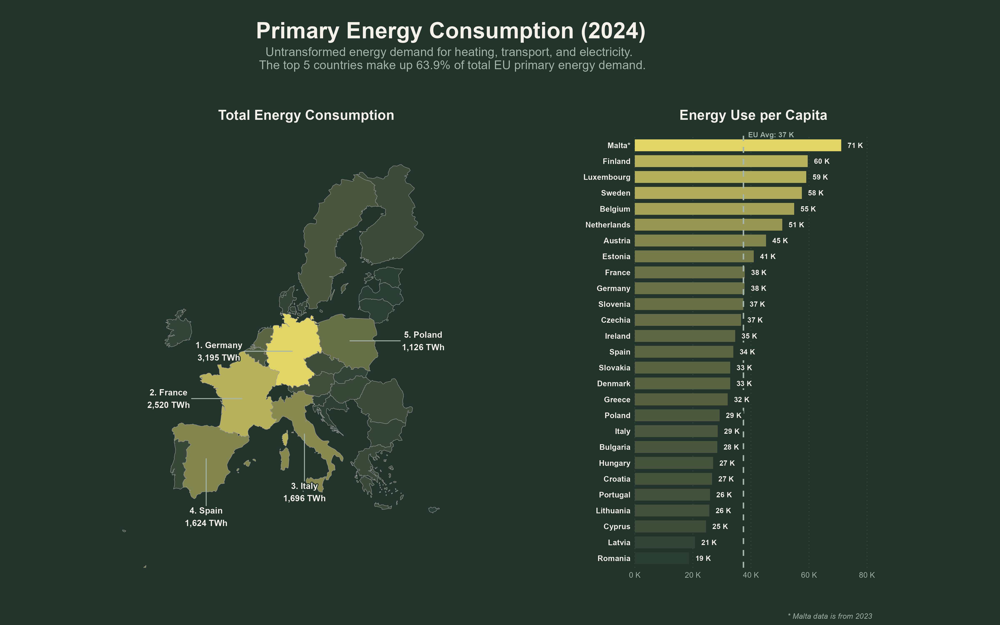
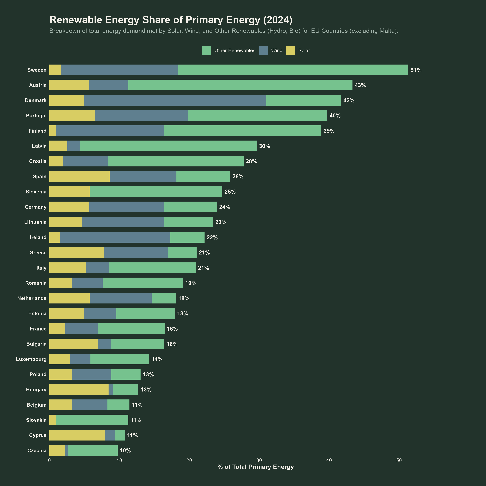
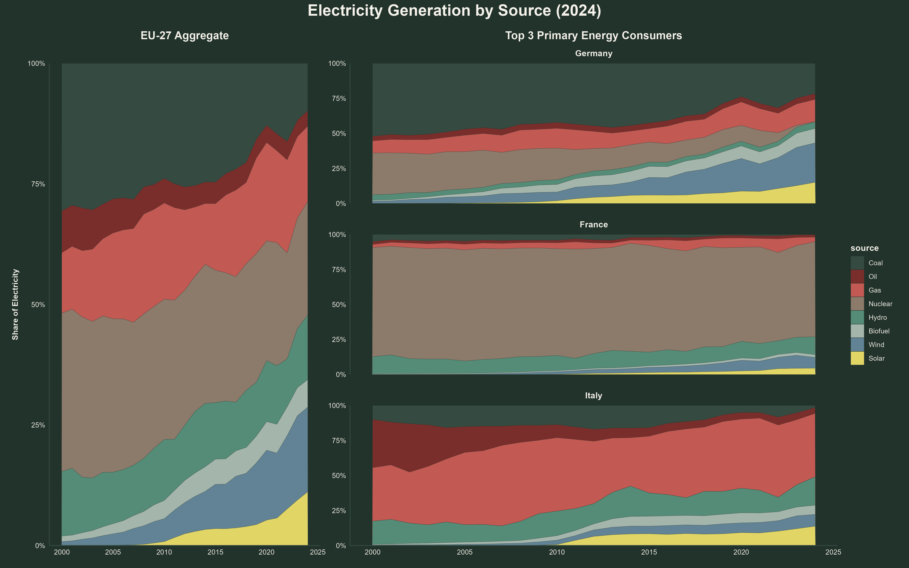
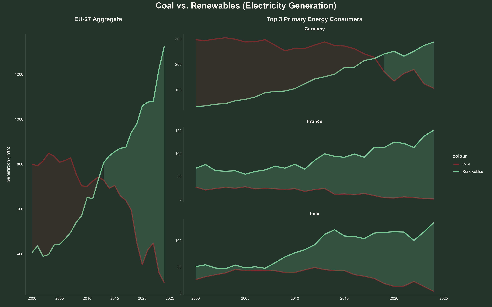
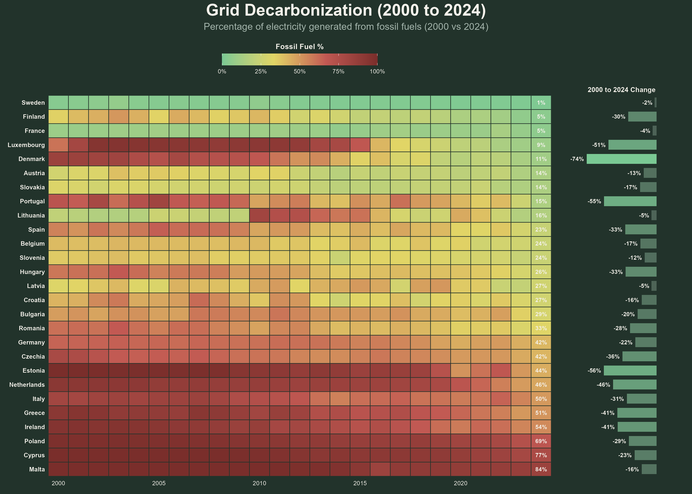
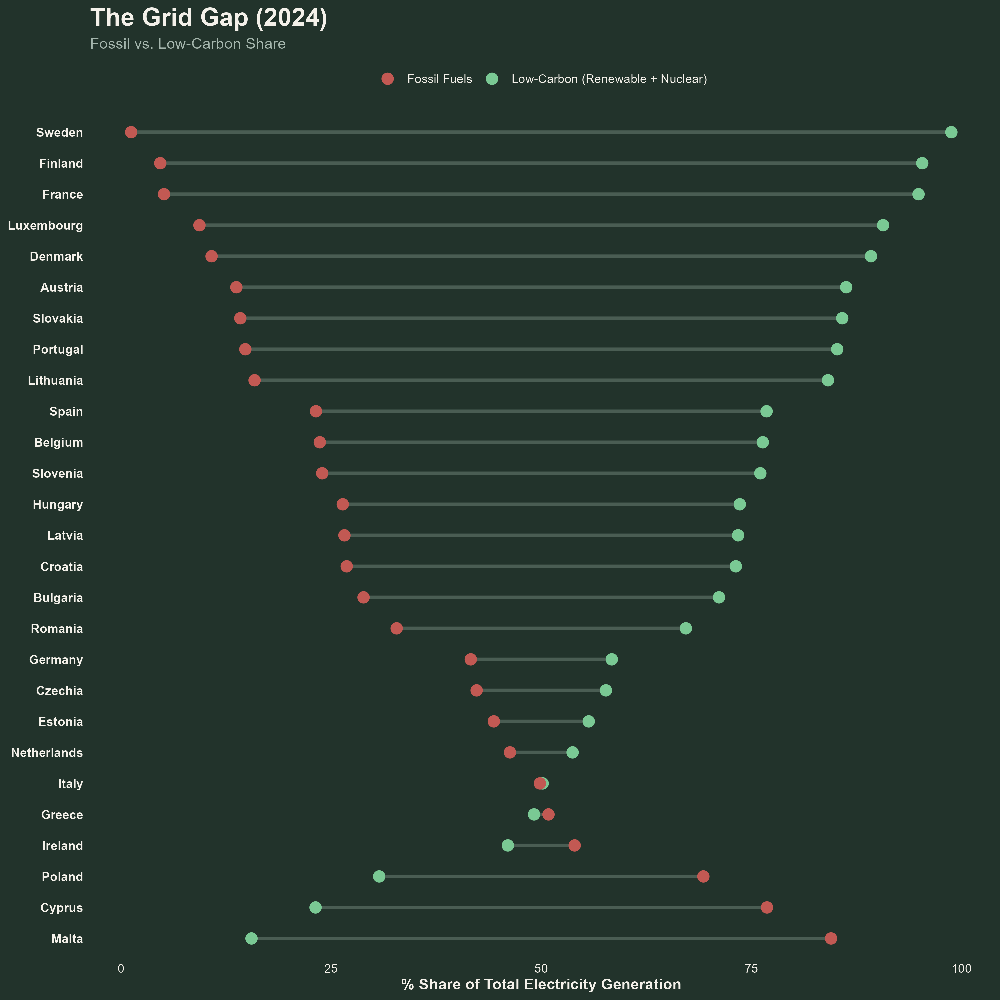
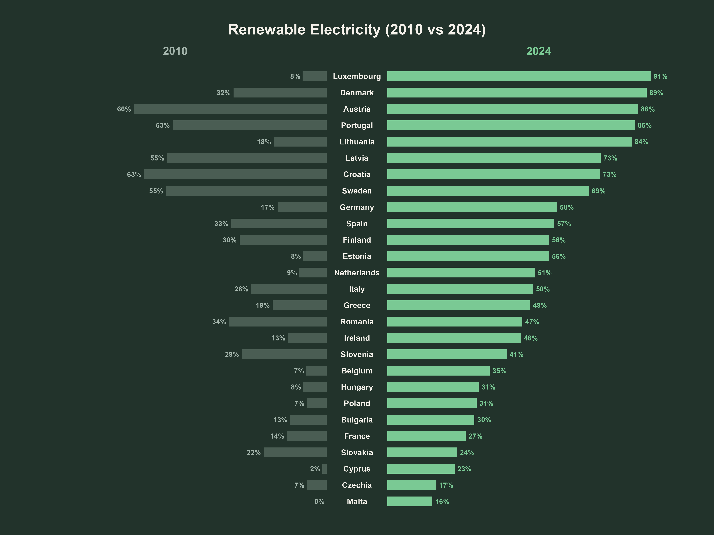
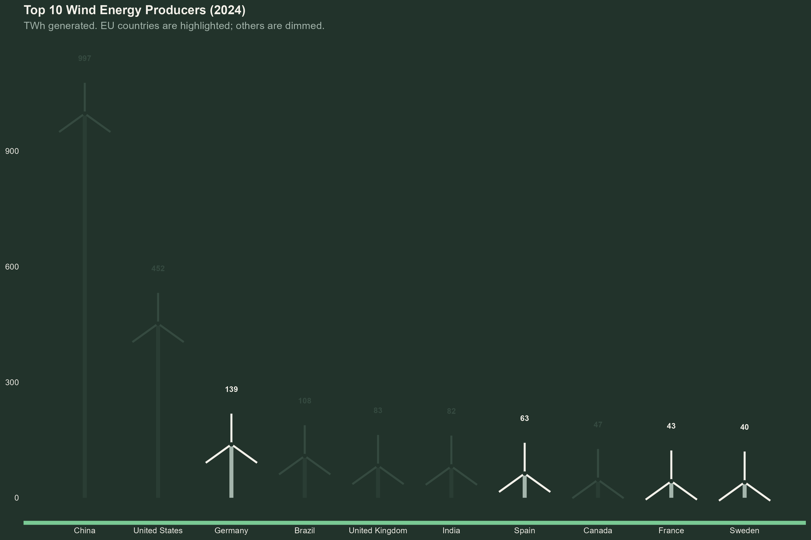
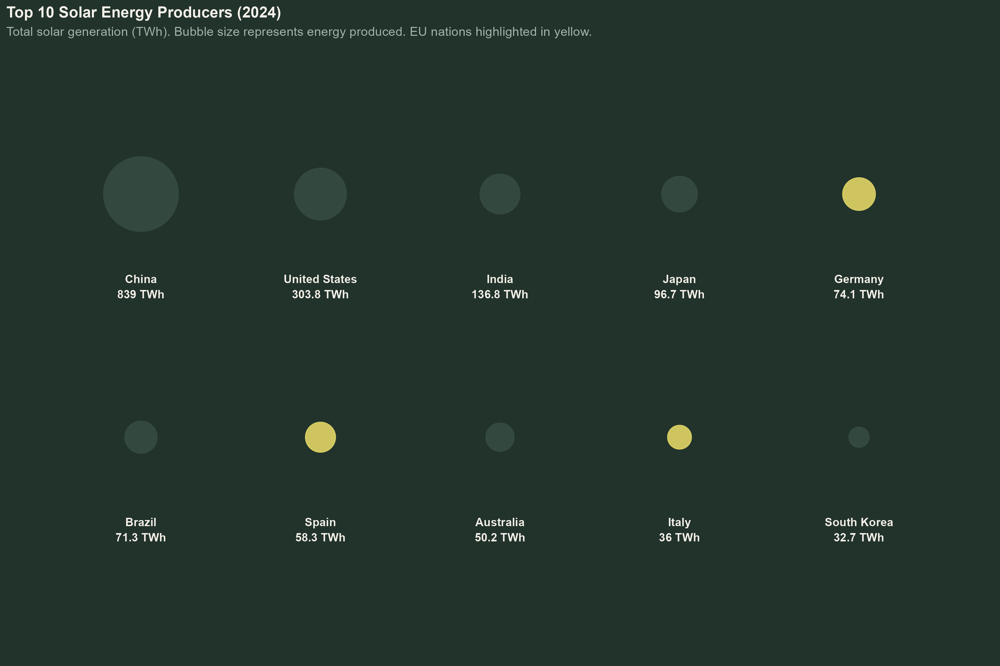
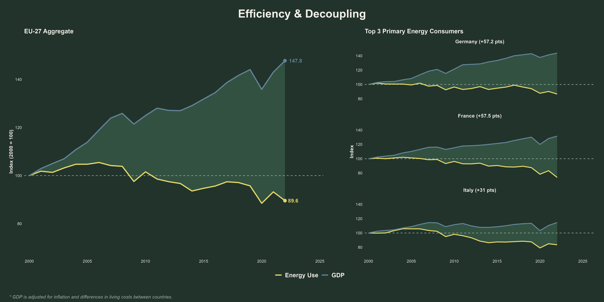

# EU-Renewable-Energy

Tracking the EU-27 energy transition from 2000 to 2024, using the [Our World in Data energy dataset](https://github.com/owid/energy-data). All charts are built in R with ggplot2. The analysis moves from overall energy demand, to the electricity mix, to the EU's position among global leaders, and finally to whether economic growth has decoupled from energy use.

## Summary

- Five countries (Germany, France, Italy, Spain, Poland) consume 63.9% of all EU primary energy; Germany alone uses 3,195 TWh.
- Per capita the picture flips: Malta, Finland and Luxembourg use the most energy per person, Romania the least (19K vs 71K kWh).
- Sweden covers the highest share of its total energy demand with renewables (51%); Czechia the lowest (10%).
- Renewables overtook coal in EU electricity generation around 2012-2013 and now produce more than four times as much (roughly 1,300 TWh in 2024).
- Wind and solar alone have grown from almost nothing in 2000 to about a quarter of EU electricity.
- Sweden runs the cleanest grid (roughly 99% low-carbon electricity); Malta (84%), Cyprus (77%) and Poland (69%) remain the most fossil-dependent.
- Denmark achieved the deepest grid decarbonization, cutting its fossil share by 74 points since 2000 (down to 11%).
- Fastest renewable electricity transformation: Luxembourg went from 8% to 91% renewable between 2010 and 2024.
- Globally, four EU countries make the wind top 10 (led by Germany, 139 TWh), but in solar the EU trails far behind China's 839 TWh.
- The EU has fully decoupled growth from energy: GDP up ~48% since 2000 while energy consumption fell ~10%.

## Primary Energy and Renewables

Total primary energy demand across the EU-27 in 2024, alongside per-capita use. Demand is heavily concentrated: Germany, France, Italy, Spain and Poland account for 63.9% of the EU total. The per-capita view flips the ranking, with Malta, Finland and Luxembourg on top and Romania using roughly a quarter of Malta's level.

How much of each country's total energy demand is met by solar, wind and other renewables. Sweden leads at 51%, but the composition matters as much as the total: Denmark's 42% is built on wind, while hydro and biomass do the heavy lifting in Sweden, Austria and Latvia, and Czechia still sits at just 10%.

## Electricity

The EU-27 electricity mix since 2000, with detail for the three largest energy consumers. Wind and solar have grown from almost nothing to roughly a quarter of EU generation while coal's share has more than halved. The country panels reveal three very different systems: nuclear-anchored France, renewables-led Germany, and gas-reliant Italy.

Absolute generation from coal versus renewables, in TWh. The EU-wide lines crossed around 2012-2013, and the gap has since exploded: by 2024 renewables deliver roughly 1,300 TWh, more than four times coal, and even lignite-heavy Germany crossed over in 2019.

Year-by-year fossil-fuel share of electricity for every member state, sorted by 2024 grid cleanliness. Denmark posts the deepest cut (-74 points, down to 11%), while Sweden and France were already nearly fossil-free in 2000. At the other end, Malta (84%), Cyprus (77%) and Poland (69%) still run predominantly on fossil fuels.

Each country's 2024 electricity generation split into fossil versus low-carbon (renewables + nuclear) share. The large majority of member states now produce more low-carbon than fossil electricity, with Sweden's grid at roughly 99% low-carbon. Poland, Cyprus and Malta remain the only clearly fossil-dominated grids, and Ireland, Greece and Italy sit at the tipping point.

Renewable share of electricity generation, 2010 versus 2024. Every single member state moved forward, and the leaders transformed entirely: Luxembourg jumped from 8% to 91%, Denmark from 32% to 89%, and Germany more than tripled from 17% to 58%.

## Wind and Solar Global Leaders

The world's largest wind power producers, EU members highlighted. China (997 TWh) and the United States (452 TWh) dominate in absolute terms, but four EU countries (Germany, Spain, France and Sweden) make the global top 10, together generating about 285 TWh.

The global solar top 10, EU members in yellow. China alone (839 TWh) produces nearly as much solar power as the other nine combined; Germany (74 TWh), Spain (58 TWh) and Italy (36 TWh) keep the EU on the map, but an order of magnitude behind.

## Economic Decoupling

GDP versus primary energy use, indexed to 2000. The EU-27 economy grew ~48% while energy consumption *fell* ~10%. The pattern holds for each of the three biggest primary energy consumers, with Germany and France opening gaps of more than 57 points between GDP growth and energy use.

---

*Data: [Our World in Data, Energy dataset](https://github.com/owid/energy-data) · Charts: R (ggplot2)*
